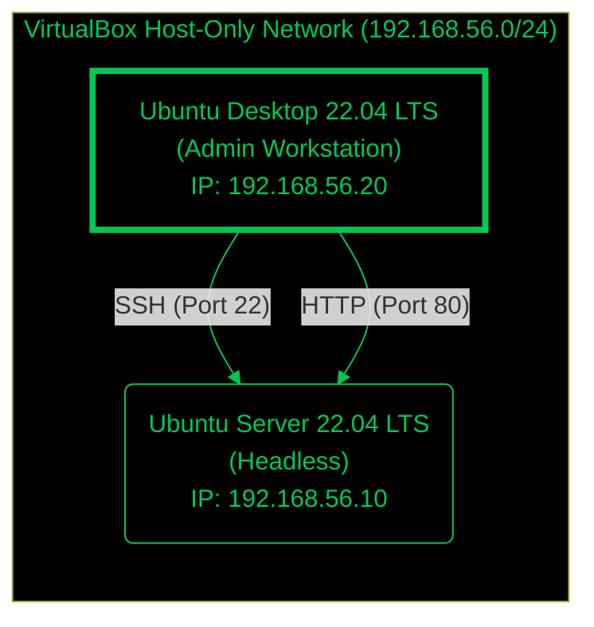

# Week 1: System Planning and Distribution Selection

## 1. System Architecture Diagram

The following diagram illustrates the planned dual-system architecture, consisting of a headless server and a remote workstation.



## 2. Distribution Selection Justification

I have selected **Ubuntu Server 22.04 LTS (Jammy Jellyfish)** for the server operating system.

| Feature | Ubuntu Server 22.04 LTS | CentOS Stream 9 | Debian 11 (Bullseye) | Justification for Selection |
| :--- | :--- | :--- | :--- | :--- |
| **Stability** | High (LTS supported until 2027) | Medium (Rolling release) | Very High | Ubuntu LTS offers a perfect balance of stability and up-to-date software packages. |
| **Package Management** | `apt` (Huge repository) | `dnf` / `rpm` | `apt` | Familiarity with `apt` and the extensive documentation available for Ubuntu. |
| **Security** | AppArmor enabled by default | SELinux enabled by default | Manual config needed | AppArmor is user-friendly and sufficient for the required security controls. |
| **Community Support** | Extensive | Good | Good | Ubuntu has the largest community support, making troubleshooting easier. |

**Conclusion:** Ubuntu Server 22.04 LTS is the optimal choice due to its long-term support, ease of use, and robust security features out-of-the-box.

## 3. Workstation Configuration

I have chosen **Option A: Linux Desktop VM**.
- **OS:** Ubuntu Desktop 22.04 LTS.
- **Justification:** Using a dedicated Linux VM for administration ensures a consistent environment that matches the server's ecosystem. It isolates the coursework tools from my personal host machine and allows for realistic network simulation within VirtualBox.

## 4. Network Configuration

The VirtualBox "Host-Only Adapter" will be used to create an isolated private network.
- **Network CIDR:** `192.168.56.0/24`
- **Server IP:** `192.168.56.10`
- **Workstation IP:** `192.168.56.20`
- **Gateway:** `192.168.56.1`

## 5. System Specifications (Simulated Output)

### `uname -a`
```bash
Linux server-vm 5.15.0-91-generic #101-Ubuntu SMP Tue Nov 14 13:30:08 UTC 2023 x86_64 x86_64 x86_64 GNU/Linux
```

### `free -h`
```bash
               total        used        free      shared  buff/cache   available
Mem:           3.8Gi       420Mi       2.1Gi       1.0Mi       1.3Gi       3.2Gi
Swap:          2.0Gi          0B       2.0Gi
```

### `df -h`
```bash
Filesystem      Size  Used Avail Use% Mounted on
/dev/sda2        20G  4.5G   15G  24% /
tmpfs           392M  1.2M  391M   1% /run
/dev/sda1       511M  5.3M  506M   2% /boot/efi
```

### `ip addr`
```bash
2: enp0s3: <BROADCAST,MULTICAST,UP,LOWER_UP> mtu 1500 qdisc fq_codel state UP group default qlen 1000
    link/ether 08:00:27:4c:a2:b3 brd ff:ff:ff:ff:ff:ff
    inet 192.168.56.10/24 brd 192.168.56.255 scope global enp0s3
       valid_lft forever preferred_lft forever
```

### `lsb_release -a`
```bash
No LSB modules are available.
Distributor ID: Ubuntu
Description:    Ubuntu 22.04.3 LTS
Release:        22.04
Codename:       jammy
```

[Home](./index.md) | [Week 2 →](week2.md)
