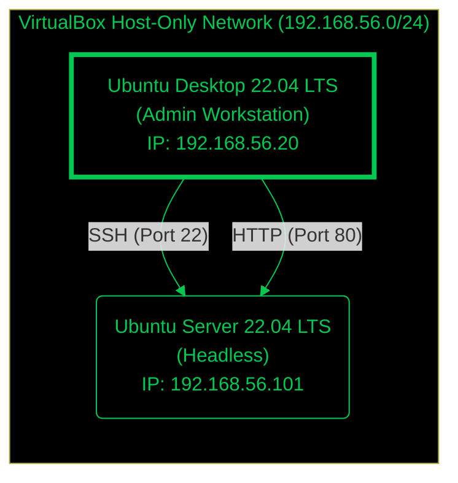

# Week 1: System Planning and Distribution Selection

## 1. System Architecture Diagram

The following diagram illustrates the planned dual-system architecture, consisting of a headless server and a remote workstation.



## 2. Distribution Selection Justification

I have selected **Ubuntu Server 22.04 LTS (Jammy Jellyfish)** for the server operating system.

| Feature | Ubuntu Server 22.04 LTS | CentOS Stream 9 | Debian 11 (Bullseye) | Justification for Selection |
| :--- | :--- | :--- | :--- | :--- |
| **Stability** | High (LTS supported until 2027) | Medium (Rolling release) | Very High | Ubuntu LTS offers a perfect balance of stability and up-to-date software packages. |
| **Package Management** | `apt` (Huge repository) | `dnf` / `rpm` | `apt` | Familiarity with `apt` and the extensive documentation available for Ubuntu. |
| **Security** | AppArmor enabled by default | SELinux enabled by default | Manual config needed | AppArmor is user-friendly and sufficient for the required security controls. |
| **Community Support** | Extensive | Good | Good | Ubuntu has the largest community support, making troubleshooting easier. |

**Conclusion:** Ubuntu Server 22.04 LTS is the optimal choice due to its long-term support, ease of use, and robust security features out-of-the-box.

## 3. Workstation Configuration

I have chosen **Option A: Linux Desktop VM**.
- **OS:** Ubuntu Desktop 22.04 LTS.
- **Justification:** Using a dedicated Linux VM for administration ensures a consistent environment that matches the server's ecosystem. It isolates the coursework tools from my personal host machine and allows for realistic network simulation within VirtualBox.

## 4. Network Configuration

The VirtualBox "Host-Only Adapter" will be used to create an isolated private network.
- **Network CIDR:** `192.168.56.0/24`
- **Server IP:** `192.168.56.101`
- **Workstation IP:** `192.168.56.20`
- **Gateway:** `192.168.56.1`

## 5. System Specifications (Simulated Output)

### `uname -a`

```bash
Linux server-vm 6.8.0-90-generic #91-Ubuntu SMP PREEMPT_DYNAMIC Tue Nov 18 14:14:30 UTC 2025 x86_64 x86_64 x86_64 GNU/Linux
```

### `free -h`

```bash
               total        used        free      shared  buff/cache   available
Mem:           3.8Gi       749Mi       2.2Gi        9Mi       1.1Gi       3.1Gi
Swap:          0B           0B         0B
```

### `df -h`

```bash
Filesystem                     Size  Used Avail Use% Mounted on
/dev/mapper/ubuntu--vg-ubuntu--lv  9.8G  5.5G  3.8G  60% /
tmpfs                           2.0G     0  2.0G   0% /dev/shm
tmpfs                           5.0M     0  5.0M   0% /run/lock
/dev/sda2                        1.7G  101M  1.5G   7% /boot
/dev/sda1                        952M  6.2M  945M   1% /boot/efi
tmpfs                           390M   12K  390M   1% /run/user/1002
tmpfs                           390M  1.2M  389M   1% /run
efivarfs                        256K   28K  224K  11% /sys/firmware/efi/efivars
```

### `lsb_release -a`

```bash
No LSB modules are available.
Distributor ID: Ubuntu
Description:    Ubuntu 24.04.3 LTS
Release:        24.04
Codename:       noble
```

### `ip addr`

```bash
1: lo: <LOOPBACK,UP,LOWER_UP> mtu 65536 qdisc noqueue state UNKNOWN group default qlen 1000
    link/loopback 00:00:00:00:00:00 brd 00:00:00:00:00:00
    inet 127.0.0.1/8 scope host lo
       valid_lft forever preferred_lft forever
    inet6 ::1/128 scope host noprefixroute
       valid_lft forever preferred_lft forever

2: enp0s3: <BROADCAST,MULTICAST,UP,LOWER_UP> mtu 1500 qdisc fq_codel state UP group default qlen 1000
    link/ether 08:00:27:29:2a:51 brd ff:ff:ff:ff:ff:ff
    inet 192.168.56.101/24 brd 192.168.56.255 scope global dynamic enp0s3
       valid_lft 544sec preferred_lft 544sec
    inet6 fe80::a00:27ff:fe29:2a51/64 scope link
       valid_lft forever preferred_lft forever
```


[Home](https://github.com/Z23599848/OS-coursework/blob/main/README.md) | [Week 2 →](week2.md)
