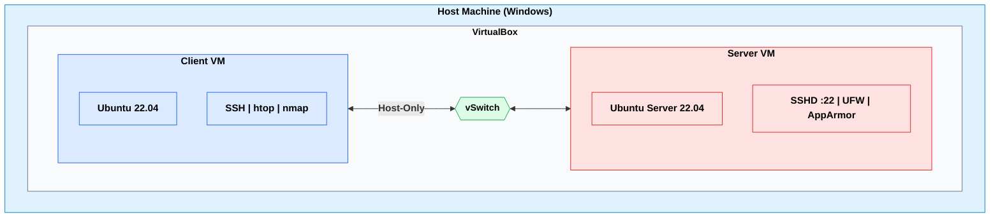

# Week 1: System Planning and Distribution Selection


This week addresses the following learning outcomes:

- **LO3**: Initial security considerations through service minimisation and headless deployment.
- **LO4**: Use of command-line tools for baseline system verification.
- **LO5**: Evaluation of operating system design trade-offs.

---

## 1. System Architecture Diagram

The following diagram illustrates the planned dual-system architecture consisting of a headless Linux server and a separate administrative workstation. This design enforces command-line proficiency while maintaining strong isolation between systems.


```mermaid
graph LR
    %% Physical Host
    subgraph Host["<b>Host Machine (Windows)</b>"]
        direction LR

        %% VirtualBox
        subgraph VBox["<b>VirtualBox</b>"]
            direction LR

            subgraph Client["<b>Client VM</b>"]
                OS_C["<b>Ubuntu 22.04</b>"]
                Tools["<b>SSH | htop | nmap</b>"]
            end

            VSwitch{{"<b>vSwitch</b>"}}

            subgraph Server["<b>Server VM</b>"]
                OS_S["<b>Ubuntu Server 22.04</b>"]
                Svc["<b>SSHD :22 | UFW | AppArmor</b>"]
            end

            Client <-->|"<b>Host-Only</b>"| VSwitch
            VSwitch <-->| | Server
        end
    end

    %% Styling
    classDef host fill:#e0f2fe,stroke:#0284c7,stroke-width:1px,color:#000,font-size:16px;
    classDef container fill:#f8fafc,stroke:#64748b,stroke-width:1px,color:#000,font-size:15px;
    classDef client fill:#dbeafe,stroke:#2563eb,stroke-width:1px,color:#000,font-size:16px;
    classDef server fill:#fee2e2,stroke:#dc2626,stroke-width:1px,color:#000,font-size:16px;
    classDef switch fill:#dcfce7,stroke:#16a34a,stroke-width:1px,color:#000,font-size:15px;

    %% Apply classes
    class Host host;
    class VBox container;
    class Client,OS_C,Tools client;
    class Server,OS_S,Svc server;
    class VSwitch switch;


```

---

## 2. Distribution Selection Justification

The selected server operating system is **Ubuntu Server 22.04 LTS (Jammy Jellyfish)**.

| Feature                | Ubuntu Server 22.04 LTS | CentOS Stream 9  | Debian 11 (Bullseye) | Justification                                                                           |
| ---------------------- | ----------------------- | ---------------- | -------------------- | --------------------------------------------------------------------------------------- |
| **Stability**          | High (LTS until 2027)   | Medium (Rolling) | Very High            | Ubuntu LTS balances long-term stability with modern packages.                           |
| **Package Management** | `apt`                   | `dnf` / `rpm`    | `apt`                | Extensive documentation and familiarity with `apt`.                                     |
| **Security**           | AppArmor enabled        | SELinux enabled  | Manual configuration | AppArmor provides effective mandatory access control with lower configuration overhead. |
| **Community Support**  | Extensive               | Good             | Good                 | Large Ubuntu community simplifies troubleshooting and learning.                         |

**Conclusion:** Ubuntu Server 22.04 LTS provides an optimal balance of stability, security, usability, and support for a headless server environment.

---

## 3. Workstation Configuration

**Selected Option:** Linux Desktop Virtual Machine

* **Operating System:** Ubuntu Desktop 22.04 LTS
* **Purpose:** Administrative access and monitoring

Using a dedicated Linux workstation ensures environmental consistency with the server, isolates coursework tooling from the host system, and enables realistic client–server interaction within VirtualBox.


*The following commands document host-side VM provisioning for reproducibility and are not part of the assessed server configuration.*


###  Install **VirtualBox 7.0.14 (stable)**

```powershell
winget install --id Oracle.VirtualBox --version 7.0.14
```

* Accept driver prompts
* Reboot after install

---

###  Verify installation

```powershell
cd "C:\Program Files\Oracle\VirtualBox"
.\VBoxManage.exe --version
```

Expected: `7.0.14r*****`

---

## Ubuntu **Server** VM (all-in-one)

```powershell
& "C:\Program Files\Oracle\VirtualBox\VBoxManage.exe" createvm --name ubuntu-server --ostype Ubuntu_64 --register; & "C:\Program Files\Oracle\VirtualBox\VBoxManage.exe" modifyvm ubuntu-server --memory 2048 --cpus 2 --nic1 hostonly --hostonlyadapter1 "VirtualBox Host-Only Ethernet Adapter"; & "C:\Program Files\Oracle\VirtualBox\VBoxManage.exe" createhd --filename "$env:USERPROFILE\VirtualBox VMs\ubuntu-server.vdi" --size 25000; & "C:\Program Files\Oracle\VirtualBox\VBoxManage.exe" storagectl ubuntu-server --name "SATA" --add sata --controller IntelAhci; & "C:\Program Files\Oracle\VirtualBox\VBoxManage.exe" storageattach ubuntu-server --storagectl "SATA" --port 0 --device 0 --type hdd --medium "$env:USERPROFILE\VirtualBox VMs\ubuntu-server.vdi"; & "C:\Program Files\Oracle\VirtualBox\VBoxManage.exe" storageattach ubuntu-server --storagectl "SATA" --port 1 --device 0 --type dvddrive --medium "C:\Users\ali_x\OneDrive\Desktop\os\ubuntu-22.04.5-live-server-amd64.iso"
```

---

## Ubuntu **Workstation** VM (all-in-one)

```powershell
& "C:\Program Files\Oracle\VirtualBox\VBoxManage.exe" createvm --name ubuntu-workstation --ostype Ubuntu_64 --register; & "C:\Program Files\Oracle\VirtualBox\VBoxManage.exe" modifyvm ubuntu-workstation --memory 4096 --cpus 2 --vram 128 --graphicscontroller vmsvga --accelerate3d on --nic1 hostonly --hostonlyadapter1 "VirtualBox Host-Only Ethernet Adapter"; & "C:\Program Files\Oracle\VirtualBox\VBoxManage.exe" createhd --filename "$env:USERPROFILE\VirtualBox VMs\ubuntu-workstation.vdi" --size 40000; & "C:\Program Files\Oracle\VirtualBox\VBoxManage.exe" storagectl ubuntu-workstation --name "SATA" --add sata --controller IntelAhci; & "C:\Program Files\Oracle\VirtualBox\VBoxManage.exe" storageattach ubuntu-workstation --storagectl "SATA" --port 0 --device 0 --type hdd --medium "$env:USERPROFILE\VirtualBox VMs\ubuntu-workstation.vdi"; & "C:\Program Files\Oracle\VirtualBox\VBoxManage.exe" storageattach ubuntu-workstation --storagectl "SATA" --port 1 --device 0 --type dvddrive --medium "C:\Users\ali_x\OneDrive\Desktop\os\ubuntu-22.04.5-desktop-amd64.iso"
```

---

## Start the VMs (when ready)

```powershell
& "C:\Program Files\Oracle\VirtualBox\VBoxManage.exe" startvm ubuntu-server
& "C:\Program Files\Oracle\VirtualBox\VBoxManage.exe" startvm ubuntu-workstation
```


---

## 4. Network Configuration

A VirtualBox Host-Only Adapter is used to create a logically isolated private network for controlled inter-VM communication.

* **Server IP:** `192.168.56.104`
* **Workstation IP:** `192.168.56.103`


This configuration supports secure administration and controlled testing throughout the coursework.

---

## 5. Baseline System Verification

Initial system verification confirms correct installation and network configuration using standard command-line utilities:

```bash
uname -a; free -h; df -h; lsb_release -a; ip addr
```


---

## Sustainability Considerations

Deploying a headless server configuration eliminates unnecessary graphical overhead, reducing CPU and memory consumption. Virtualisation improves hardware utilisation by consolidating workloads, supporting lower energy usage per system. Selecting an LTS distribution further reduces frequent upgrade cycles, extending system lifespan and contributing to reduced operational waste.

---

## Initial Security Assumptions

* The server operates within a trusted, isolated network.
* SSH is the sole remote access mechanism.
* Only essential services are enabled.
* Firewall and mandatory access control policies will be progressively hardened in later weeks.

---

## Week 1 Reflection

This week focused on architectural planning and foundational system decisions. The resulting environment prioritises isolation, sustainability, and security, providing a controlled baseline for subsequent hardening, performance analysis, and automation tasks.

---

[Home](https://github.com/Z23599848/OS-coursework/blob/main/README.md) | [Week 2 →](week2.md)
