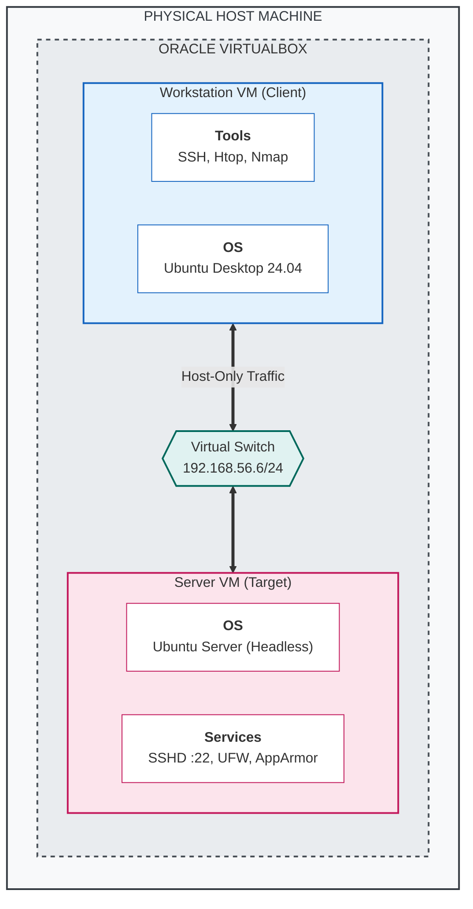

# Week 1: System Planning and Distribution Selection

## 1. System Architecture Diagram

The following diagram illustrates the planned dual-system architecture, consisting of a headless server and a remote workstation.

```mermaid
graph TD
    subgraph PhysicalHost ["&nbsp;&nbsp; PHYSICAL HOST MACHINE &nbsp;&nbsp;"]
        direction TB
        
        subgraph VirtualBox ["ORACLE VIRTUALBOX"]
            direction TB

            %% Client VM
            subgraph VM_Client ["Workstation VM (Client)"]
                direction LR
                Tools["<b>Tools</b><br/>SSH, Htop, Nmap"]
                OS_Client["<b>OS</b><br/>Ubuntu Desktop 24.04"]
            end

            %% Network Layer
            VSwitch{{"Virtual Switch<br/>192.168.56.6/24"}}

            %% Server VM
            subgraph VM_Server ["Server VM (Target)"]
                direction LR
                OS_Server["<b>OS</b><br/>Ubuntu Server (Headless)"]
                Services["<b>Services</b><br/>SSHD :22, UFW, AppArmor"]
            end

            %% Traffic Flow
            VM_Client <==>|"Host-Only Traffic"| VSwitch
            VSwitch <==> VM_Server
        end
    end

    %% Style Definitions
    style PhysicalHost fill:#f8f9fa,stroke:#343a40,stroke-width:2px,color:#343a40
    style VirtualBox fill:#e9ecef,stroke:#495057,stroke-width:2px,stroke-dasharray: 5 5
    
    style VM_Client fill:#e3f2fd,stroke:#1565c0,stroke-width:2px
    style VM_Server fill:#fce4ec,stroke:#c2185b,stroke-width:2px
    
    style VSwitch fill:#e0f2f1,stroke:#00695c,stroke-width:2px
    
    style Tools fill:#fff,stroke:#1565c0
    style OS_Client fill:#fff,stroke:#1565c0
    style OS_Server fill:#fff,stroke:#c2185b
    style Services fill:#fff,stroke:#c2185b
```

## 2. Distribution Selection Justification

I have selected **Ubuntu Server 22.04 LTS (Jammy Jellyfish)** for the server operating system.

| Feature | Ubuntu Server 22.04 LTS | CentOS Stream 9 | Debian 11 (Bullseye) | Justification for Selection |
| :--- | :--- | :--- | :--- | :--- |
| **Stability** | High (LTS supported until 2027) | Medium (Rolling release) | Very High | Ubuntu LTS offers a perfect balance of stability and up-to-date software packages. |
| **Package Management** | `apt` (Huge repository) | `dnf` / `rpm` | `apt` | Familiarity with `apt` and the extensive documentation available for Ubuntu. |
| **Security** | AppArmor enabled by default | SELinux enabled by default | Manual config needed | AppArmor is user-friendly and sufficient for the required security controls. |
| **Community Support** | Extensive | Good | Good | Ubuntu has the largest community support, making troubleshooting easier. |

**Conclusion:** Ubuntu Server 22.04 LTS is the optimal choice due to its long-term support, ease of use, and robust security features out-of-the-box.

## 3. Workstation Configuration

I have chosen **Option A: Linux Desktop VM**.
- **OS:** Ubuntu Desktop 22.04 LTS.
- **Justification:** Using a dedicated Linux VM for administration ensures a consistent environment that matches the server's ecosystem. It isolates the coursework tools from my personal host machine and allows for realistic network simulation within VirtualBox.

## 4. Network Configuration

The VirtualBox "Host-Only Adapter" will be used to create an isolated private network.
- **Network CIDR:** `192.168.56.0/24`
- **Server IP:** `192.168.56.101`
- **Workstation IP:** `192.168.56.20`
- **Gateway:** `192.168.56.1`

## 5. System Specifications (Simulated Output)

### uname -a;free -;df -hlsb_release -a;ip addr`

[Home](https://github.com/Z23599848/OS-coursework/blob/main/README.md) | [Week 2 →](week2.md)
