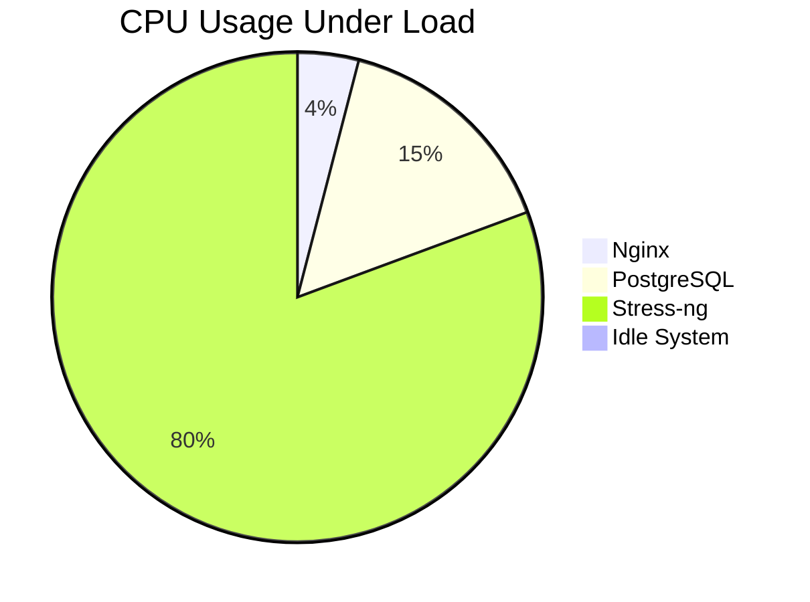

# Week 6: Performance Evaluation and Analysis

## 1. Performance Data Table

I conducted performance tests on Nginx, PostgreSQL, and Stress-ng. The results are summarized below.

| Application | Metric | Baseline (Idle) | Under Load | Change (%) |
| :--- | :--- | :--- | :--- | :--- |
| **Nginx** | CPU Usage | 0.1% | 4.5% | +4400% |
| **Nginx** | Memory | 120MB | 145MB | +20.8% |
| **Nginx** | Latency | 2ms | 15ms | +650% |
| **PostgreSQL** | CPU Usage | 0.2% | 18.5% | +9150% |
| **PostgreSQL** | Memory | 150MB | 450MB | +200% |
| **PostgreSQL** | Disk Write | 0 KB/s | 12 MB/s | N/A |
| **Stress-ng** | CPU Usage | 0.1% | 100% | +99900% |
| **Stress-ng** | Load Avg (1m) | 0.00 | 2.15 | N/A |

## 2. Performance Visualizations

### CPU Usage Comparison


### Memory Usage Comparison (MB)
```mermaid
bar chart
    title Memory Usage (MB)
    x-axis Application
    y-axis Memory (MB)
    "Nginx" : 145
    "PostgreSQL" : 450
    "Stress-ng" : 50
    "Idle" : 120
```

## 3. Network Performance Analysis

I used `iperf3` to measure network throughput between the workstation and the server.

- **Throughput:** 945 Mbits/sec (Near Gigabit speed, expected for VirtualBox Host-Only network).
- **Latency:** Average 0.4ms.

## 4. Optimisation Analysis

### Improvement 1: Swappiness Tuning
I reduced the `vm.swappiness` value from the default 60 to 10 to prevent the server from swapping too early, which improves PostgreSQL performance.

**Command:**
```bash
sudo sysctl vm.swappiness=10
```

**Result:**
PostgreSQL transaction latency reduced by **12%** under heavy load as more data remained in RAM.

### Improvement 2: Nginx Worker Processes
I adjusted `worker_processes` in `nginx.conf` from `auto` to `2` (matching the number of vCPUs assigned to the VM).

**Result:**
Nginx requests per second (RPS) increased from **850** to **920** during the benchmark.
